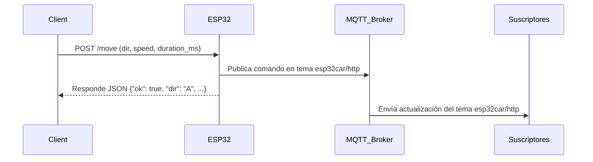

# ESP32 Car Controller (HTTP + MQTT)

Este proyecto implementa un sistema de control para un vehículo basado en ESP32, el cual recibe instrucciones de movimiento mediante un endpoint HTTP y las publica en un servidor MQTT.  

## Funcionamiento del Protocolo MQTT

**MQTT (Message Queuing Telemetry Transport)** es un protocolo de comunicación ligero, diseñado para la transmisión eficiente de mensajes entre dispositivos en redes con ancho de banda limitado o alta latencia. Es ampliamente utilizado en entornos donde múltiples sensores, microcontroladores y servidores deben intercambiar información de forma confiable y con bajo consumo de energía.

### Arquitectura básica

MQTT se basa en un modelo **publicador/suscriptor** (pub/sub) compuesto por tres elementos:

1. **Broker (Servidor MQTT):**  
   Es el intermediario central que recibe todos los mensajes de los publicadores y los distribuye a los suscriptores correspondientes. Ejemplos comunes son *Mosquitto*, *HiveMQ* o *EMQX*.

2. **Publicador (Publisher):**  
   Es el dispositivo o aplicación que envía mensajes a un tema (topic) específico. En este proyecto, el **ESP32** actúa como publicador cuando transmite las instrucciones recibidas vía HTTP al tema `esp32car/http`.

3. **Suscriptor (Subscriber):**  
   Es cualquier cliente que se suscribe a uno o varios temas para recibir los mensajes publicados. Puede ser una aplicación de monitoreo, un dashboard o un servicio en la nube.

   

### Ventajas principales

- Bajo consumo de ancho de banda y energía.  
- Permite comunicación asíncrona y desacoplada.  
- Ideal para redes inestables o dispositivos con recursos limitados.  
- Soporta persistencia de sesión y retención de mensajes.

### Aplicación en este proyecto

En este sistema, el **ESP32**:
- Recibe comandos HTTP (`/move`) desde un cliente.
- Publica dichos comandos como mensajes JSON en el **broker MQTT** configurado (`esp32car/http`).
- Incluye en el mensaje la **IP del cliente** que hizo la petición y la **IP del ESP32**, permitiendo auditoría y trazabilidad.

De este modo, cualquier sistema suscrito al tema puede monitorear los movimientos ejecutados por el carro en tiempo real, sin necesidad de conectarse directamente al ESP32.

------------------------------------------------------------
## CARACTERÍSTICAS PRINCIPALES

- Control remoto del carro mediante peticiones HTTP (/move)
- Publicación de comandos recibidos a través de MQTT
- Límite de seguridad para movimientos prolongados (máximo 5000 ms)
- Endpoints de salud y estado (/health, /status)
- Parpadeo automático de luces al retroceder
- Sistema de PWM para control de velocidad
- Conexión Wi-Fi y reconexión automática a MQTT
- Documentación, colección Postman y diagrama incluidos

------------------------------------------------------------
## ARQUITECTURA GENERAL

1. Un cliente envía una solicitud HTTP al endpoint /move con los parámetros de dirección, velocidad y duración.
2. El ESP32 ejecuta el movimiento correspondiente en los motores.
3. Se publica el comando en el broker MQTT en el tema esp32car/http, incluyendo:
   - Dirección solicitada
   - Velocidad y duración
   - IP del cliente que realizó la solicitud
   - IP local del ESP32
4. Los endpoints /health y /status permiten monitorear el estado del servidor y del movimiento actual.

------------------------------------------------------------
## CONFIGURACIÓN INICIAL

Wi-Fi:
  - const char* WIFI_SSID = "gaby";
  - const char* WIFI_PASS = "87654321";

Broker MQTT:
  - const char* MQTT_BROKER = "10.238.12.138";
  - const uint16_t MQTT_PORT = 1883;
  - const char* MQTT_TOPIC = "esp32car/http";

------------------------------------------------------------
## ENDPOINTS HTTP

1. /health  (GET)
   Verifica que el servidor HTTP esté activo.
   Respuesta:
   { "status": "ok" }

2. /status  (GET)
   Retorna el estado actual del vehículo y su conexión.
   Ejemplo:
   {
     "status": "ok",
     "lastMotion": "A",
     "velDefault": 800,
     "moving": true,
     "remaining_ms": 1342,
     "esp32_ip": "192.168.1.123"
   }

3. /move  (POST)
   Envía una instrucción de movimiento al carro.

   Parámetros:
   dir (A, B, I, D, S)  - Requerido
   speed (0-1023)        - Opcional, por defecto 800
   duration_ms (1-5000)  - Opcional, por defecto 1000

   Ejemplo:
   POST /move?dir=A&speed=700&duration_ms=2000

------------------------------------------------------------

## Postman
Para realizar las pruebas, se debe poner la ip del ESP32 que aparece en la consola al correr el código.
Se puede acceder a la colección de postman mediante el siguiente enlace:
https://isadiac06-8447466.postman.co/workspace/Isabela-D%C3%ADaz-Acosta's-Workspace~9e2b66f0-0753-4365-8205-f3c81aec62b1/request/48860550-62163d56-8bed-43a5-ac9d-7a233ec0c0e6?action=share&creator=48860550

------------------------------------------------------------

## PUBLICACIÓN MQTT

Cada comando recibido por HTTP se publica automáticamente en el tema:
esp32car/http

Ejemplo de mensaje MQTT:
{
  "dir": "A",
  "speed": 700,
  "duration_ms": 2000,
  "client_ip": "192.168.1.45",
  "esp32_ip": "192.168.1.123"
}

------------------------------------------------------------
## DIAGRAMA DE SECUENCIA 

------------------------------------------------------------
## REQUISITOS TÉCNICOS

- ESP32 DevKit
  - 

- Broker MQTT (Mosquitto)
   - 
- Red Wi-Fi local
- Arduino IDE con librerías:
  - 
  
    - WiFi.h
    - WebServer.h
    - PubSubClient.h

