# ESP32 Car Controller (HTTP + MQTT + Sensor Ultrasónico)

**Autores:** Gabriela Bejarano, Isabela Díaz, Mauricio Suárez

Este proyecto implementa un sistema de control para un vehículo basado en **ESP32**, el cual recibe instrucciones de movimiento mediante un endpoint HTTP y las publica en un servidor MQTT.
Además, incluye un **sensor ultrasónico HC-SR04 (real o simulado)** que permite medir el entorno y transmitir la distancia a obstáculos cercanos en tiempo real mediante MQTT.

---

## Funcionamiento del Protocolo MQTT

**MQTT (Message Queuing Telemetry Transport)** es un protocolo de comunicación ligero, diseñado para la transmisión eficiente de mensajes entre dispositivos en redes con ancho de banda limitado o alta latencia. Es ampliamente utilizado en entornos donde múltiples sensores, microcontroladores y servidores deben intercambiar información de forma confiable y con bajo consumo de energía.

### Arquitectura básica

MQTT se basa en un modelo **publicador/suscriptor** (pub/sub) compuesto por tres elementos:

1. **Broker (Servidor MQTT):**
   Es el intermediario central que recibe todos los mensajes de los publicadores y los distribuye a los suscriptores correspondientes. Ejemplos comunes son *Mosquitto*, *HiveMQ* o *EMQX*.

2. **Publicador (Publisher):**
   Es el dispositivo o aplicación que envía mensajes a un tema (topic) específico.
   En este proyecto, el **ESP32** actúa como publicador cuando transmite:

   * Instrucciones recibidas vía HTTP al tema `esp32car/http`.
   * Lecturas del sensor ultrasónico al tema `esp32car/distance`.

3. **Suscriptor (Subscriber):**
   Es cualquier cliente que se suscribe a uno o varios temas para recibir los mensajes publicados.
   Puede ser una aplicación de monitoreo, un dashboard o un script Python para visualizar datos en tiempo real.

   

### Ventajas principales

* Bajo consumo de ancho de banda y energía.
* Comunicación asíncrona y desacoplada.
* Ideal para redes inestables o dispositivos con recursos limitados.
* Soporta persistencia de sesión y retención de mensajes.

### Aplicación en este proyecto

En este sistema, el **ESP32**:

* Recibe comandos HTTP (`/move`) desde un cliente.
* Publica dichos comandos como mensajes JSON en el **broker MQTT** (`esp32car/http`).
* Mide la distancia a obstáculos mediante un sensor **HC-SR04** o un **simulador interno**.
* Publica las lecturas del entorno en el tema **`esp32car/distance`**.
* Incluye en cada mensaje la **IP local del ESP32**, lo que permite monitoreo remoto y trazabilidad.

---

## CARACTERÍSTICAS PRINCIPALES

* Control remoto del carro mediante peticiones HTTP (/move)
* Publicación de comandos recibidos a través de MQTT
* Lectura en tiempo real del entorno con sensor ultrasónico (real o simulado)
* Límite de seguridad para movimientos prolongados (máximo 5000 ms)
* Endpoints de salud y estado (/health, /status)
* Parpadeo automático de luces al retroceder
* Sistema de PWM para control de velocidad
* Conexión Wi-Fi y reconexión automática a MQTT
* Documentación, colección Postman y script de monitoreo incluidos

---

## ARQUITECTURA GENERAL

1. Un cliente envía una solicitud HTTP al endpoint `/move` con los parámetros de dirección, velocidad y duración.
2. El ESP32 ejecuta el movimiento correspondiente en los motores.
3. Se publica el comando en el broker MQTT (`esp32car/http`).
4. Paralelamente, el ESP32 mide la distancia con el **HC-SR04** (o simulador) y publica los resultados en `esp32car/distance`.
5. Los suscriptores (scripts o dashboards) reciben las actualizaciones en tiempo real.

---
## Librerías
- Interfaz Gráfica
```cpp
import math
import json
import threading
import requests
import paho.mqtt.client as mqtt
import customtkinter as ctk
import tkinter as tk
```
- Cliente
```cpp
import paho.mqtt.client as mqtt
import ssl
import json
```
- ESP-32
```cpp
#include <Arduino.h>
#include <WiFi.h>
#include <WiFiClientSecure.h>  
#include <WebServer.h>
#include <PubSubClient.h>
#include "config.h"
```
---

## CONFIGURACIÓN INICIAL

**Wi-Fi:**

```cpp
const char* WIFI_SSID = "gaby";
const char* WIFI_PASS = "87654321";
```

**Broker MQTT:**

```cpp
const char* MQTT_BROKER = "10.238.12.138";
const uint16_t MQTT_PORT = 1883;
const char* MQTT_TOPIC = "esp32car/http";
const char* MQTT_TOPIC_SENSOR = "esp32car/distance";
```

**Sensor ultrasónico:**

```cpp
#define USE_HCSR04 0   // 0 = Simulador | 1 = Sensor físico
#define HCSR04_TRIG_PIN 5
#define HCSR04_ECHO_PIN 18
#define SENSOR_PUBLISH_INTERVAL_MS 2000
```

> ⚠️ Si `USE_HCSR04` está en `1`, asegúrate de usar un **divisor de voltaje o level shifter** en el pin ECHO, ya que el HC-SR04 trabaja a 5V y el ESP32 solo soporta 3.3V.

---

## ENDPOINTS HTTP

### 1. `/api/v1/healthcheck` (GET)

Verifica que el servidor HTTP esté activo.
**Respuesta:**

```json
{ "status": "ok" }
```

### 2. `/api/v1/status` (GET)

Retorna el estado actual del vehículo y su conexión.
**Ejemplo:**

```json
{
  "status": "ok",
  "lastMotion": "A",
  "velDefault": 800,
  "moving": true,
  "remaining_ms": 1342,
  "esp32_ip": "192.168.1.123"
}
```

### 3. `/api/v1/move` (POST)

Envía una instrucción de movimiento al carro.
**Parámetros:**

* `dir` (A, B, I, D, S) — Requerido
* `speed` (0–1023) — Opcional, por defecto 800
* `duration_ms` (1–5000) — Opcional, por defecto 1000

**Ejemplo:**

```
POST /move?dir=A&speed=700&duration_ms=2000
```

---

## NUEVO: SENSOR ULTRASÓNICO (HC-SR04 + SIMULADOR)

El ESP32 puede medir distancias en tiempo real mediante un **HC-SR04 físico** o un **simulador interno**.

* En modo **simulado** (`USE_HCSR04 = 0`), el sensor genera distancias oscilantes entre **10 y 200 cm**, imitando obstáculos cercanos.
* En modo **físico** (`USE_HCSR04 = 1`), se usa el sensor conectado a los pines definidos en `config.h`.

### Mensaje MQTT publicado:

**Tema:** `esp32car/distance`
**Ejemplo:**

```json
{
  "distance_cm": 82.45,
  "esp32_ip": "192.168.1.123"
}
```

La publicación se realiza cada 2 segundos (configurable).

---

## SCRIPT DE PRUEBA (MONITOREO EN TIEMPO REAL)

Para visualizar los datos de distancia en tiempo real desde tu PC:

### script_subscriber.py

```python
import paho.mqtt.client as mqtt
import json

BROKER = "10.238.12.138"  # IP del broker MQTT
PORT = 1883
TOPIC = "esp32car/distance"

def on_message(client, userdata, msg):
    try:
        data = json.loads(msg.payload.decode())
        distance = data.get("distance_cm")
        ip = data.get("esp32_ip")
        print(f"ESP32 {ip} -> Distancia: {distance:.2f} cm")
    except Exception as e:
        print(f"Error al procesar mensaje: {e}")

client = mqtt.Client()
client.on_message = on_message
client.connect(BROKER, PORT, 60)
client.subscribe(TOPIC)

print(f"Suscrito al tópico {TOPIC}. Esperando datos...\\n")

try:
    client.loop_forever()
except KeyboardInterrupt:
    print("\\nDesconectando...")
    client.disconnect()
```

### Ejecución:

```bash
python script_subscriber.py
```

> Verás lecturas periódicas del entorno (reales o simuladas).
> Puedes usar este script para graficar, registrar o procesar datos en tiempo real.

---

## PUBLICACIÓN MQTT

Cada comando recibido por HTTP se publica automáticamente en el tema:
`esp32car/http`

**Ejemplo de mensaje MQTT:**

```json
{
  "dir": "A",
  "speed": 700,
  "duration_ms": 2000,
  "client_ip": "192.168.1.45",
  "esp32_ip": "192.168.1.123"
}
```

Además, el **sensor ultrasónico** publica en:
`esp32car/distance`
con el formato mostrado anteriormente.

---

## DIAGRAMA DE SECUENCIA

```mermaid
sequenceDiagram
    participant Client
    participant ESP32
    participant MQTT_Broker
    participant Suscriptores

    Client->>ESP32: POST /move (dir, speed, duration_ms)
    ESP32->>MQTT_Broker: Publica comando en tema esp32car/http
    ESP32->>MQTT_Broker: Publica distancia en tema esp32car/distance
    ESP32-->>Client: Responde JSON {"ok": true, "dir": "A", ...}
    MQTT_Broker->>Suscriptores: Envía actualizaciones de ambos temas
```



---

## REQUISITOS TÉCNICOS

* **ESP32 DevKit**

  * 
* **Broker MQTT (Mosquitto)**

  * 
* **Red Wi-Fi local**
* **Arduino IDE** con librerías:

  * 

    * WiFi.h
    * WebServer.h
    * PubSubClient.h

---

## Postman

Para realizar las pruebas HTTP, coloca la IP del ESP32 que aparece en la consola al ejecutar el código.

## 🔐 MQTT Seguro (TLS/SSL) en el ESP32

Esta sección explica cómo se implementó la conexión **MQTT segura (puerto 8883 con TLS/SSL)** en el ESP32, usando un **certificado de Autoridad Certificadora (CA)** para validar la identidad del broker Mosquitto.

---

###  ¿Qué se hizo?

El ESP32 originalmente usaba MQTT sin cifrado (**puerto 1883**).  
Para proteger la comunicación y evitar ataques MITM, se integró:

- `WiFiClientSecure` en lugar de `WiFiClient`
- Importación del certificado `ca.crt`
- Conexión MQTT cifrada usando TLS/SSL
- Puerto seguro **8883**

Ahora toda la comunicación entre el carro y el broker viaja cifrada y autenticada.

---

###  Cambios principales en el código

####  1. Se añadió el certificado CA dentro del firmware

El archivo `ca.crt` se incrustó en el código usando un bloque RAW:

const char ca_cert[] PROGMEM = R"EOF(
-----BEGIN CERTIFICATE-----
( contenido del certificado )
-----END CERTIFICATE-----
)EOF";

2. Se reemplazó el cliente no seguro por uno cifrado

Antes:

WiFiClient wifiClient;
PubSubClient mqtt(wifiClient);


Ahora:

WiFiClientSecure secureClient;
PubSubClient mqtt(secureClient);

## Documentación Memoria


### Memoria de Programa (Flash)

Uso: 1,043,055 bytes

Porcentaje utilizado: 79%

Máximo disponible: 1,310,720 bytes

Esto indica que el firmware ocupa un 79% del espacio disponible en la Flash del ESP32. Aún queda margen suficiente para agregar funcionalidades adicionales, aunque se recomienda optimizar si el proyecto continúa creciendo.

### Memoria Dinámica (RAM)

Variables globales usadas: 46,056 bytes

Porcentaje utilizado: 14%

Memoria restante: 281,624 bytes

Máximo disponible: 327,680 bytes

El uso de RAM es bastante bajo (solo un 14%), lo cual garantiza un funcionamiento estable, dejando espacio para tareas, buffers, sensores y funciones adicionales en tiempo de ejecución.

# MQTT 
## **¿Cómo funciona?**

### **1. Telemetría de distancia (sensor / simulada)**

*Tópico:*

```
esp32car/distance
```

*Payload JSON enviado cada 2 segundos:*

```json
{
  "distance_cm": 151.25,
  "esp32_ip": "172.20.10.2"
}
```

**Descripción de campos:**

| Campo         | Tipo         | Descripción                                                                                |
| ------------- | ------------ | ------------------------------------------------------------------------------------------ |
| `distance_cm` | `float/null` | Distancia medida por el ultrasonido. Si el sensor falla o detecta fuera de rango → `null`. |
| `esp32_ip`    | `string`     | IP local del ESP32 dentro de la red del hotspot.                                           |

Este mensaje es recibido automáticamente por:

* Tu **script en Python**
* El **GUI (dashboard)** y actualiza el radar
* Cualquier otro cliente suscrito a `esp32car/#`

Ejemplo real en consola:

```
ESP32 172.20.10.2 → Distancia: 32.6 cm
```

---

### **2. Telemetría de movimiento (cada vez que presionas un botón)**

*Tópico:*

```
esp32car/http
```

*Payload JSON cuando presionas un botón del GUI:*

```json
{
  "dir": "A",
  "speed": 800,
  "duration_ms": 1000,
  "client_ip": "172.20.10.3",
  "esp32_ip": "172.20.10.2"
}
```

**Descripción:**

| Campo         | Descripción                                                      |
| ------------- | ---------------------------------------------------------------- |
| `dir`         | Dirección (A=adelante, B=atrás, I=izquierda, D=derecha, S=stop). |
| `speed`       | Velocidad PWM aplicada a motores.                                |
| `duration_ms` | Tiempo de movimiento antes de autostop.                          |
| `client_ip`   | IP del dispositivo que envió la orden (tu PC con GUI).           |
| `esp32_ip`    | IP del robot.                                                    |

Ejemplo real visto en el broker:

```
"dir":"D","speed":800,"duration_ms":1000,"client_ip":"172.20.10.3"
```

---

### **3. Estado del robot (solo si se pregunta por HTTP)**

Este no es MQTT, pero complementa la telemetría.

*Endpoint:*

```
/status
```

Ejemplo:

```json
{
  "status": "ok",
  "lastMotion": "A",
  "velDefault": 800,
  "moving": true,
  "remaining_ms": 250,
  "esp32_ip": "172.20.10.2"
}
```

## Presentacion 

https://www.canva.com/design/DAG5kSDPjQI/19BIYSjw5aU87w6jjS4K_g/edit?utm_content=DAG5kSDPjQI&utm_campaign=designshare&utm_medium=link2&utm_source=sharebutton


📎 Colección Postman:
[👉 Enlace directo](https://isadiac06-8447466.postman.co/workspace/Isabela-D%C3%ADaz-Acosta's-Workspace~9e2b66f0-0753-4365-8205-f3c81aec62b1/collection/48860550-8b0edd90-5e8c-4ea3-a6af-769d312878a0?action=share&creator=48860550)
